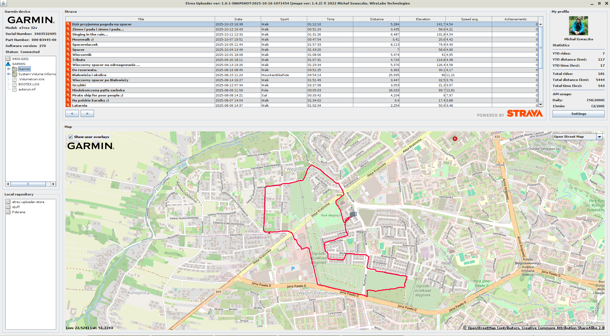
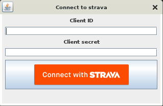

ABOUT
=
Etrex-uploader is a software for directly uploading your gps tracks from usb-cable connected Garmin devices, like Etrex etc.
It is also a swift Strava activities viewer, which allows you to view your strava activities and gps tracks on selected maps.
The application comes with OpenStreetMap support only, but you can place other map-definition files in the maps directory, 
to use whatever you like best. Application is mostly fully configurable. You need to have a Strava account, obviously ;)
Here's a simple screenshot of the application's main window. 

This software needs configuring your Strava account for API usage. It is not normally used but if you want to use Strava
remotely via the API (like this application does) you need to setup your own API application.
Go to https://www.strava.com/settings/api, setup your API Application,  and use the  application client secret and id in the initial 
etrex-uploader setup dialog.

IMPORTANT!
=
This application runs best with Java 11. 
If you run in java version bigger than 11 -> then the runtime does not start, because of changes in built-in JAXB, it's no longer in the jvm itself.  
The cause is the use of jaxb in a dependant jmaps-viewer project.
You need to add jars to the classpath, or add glassfish implementations to pom.xml. None of these solutions is recommended. Just run it from Java 11.
However, there's a workaround planned so that it works out of the box anytime with any java >=11. Stay tuned, but until then - use Java 11.

RUN
==
To run the application outside the development environment

- mvn clean package in the source dir, this will create target/etrex-uploader.zip file
- Unpack this file to some location on your local computer
- cd to that location 
- run it: java -jar etrex-uploader.jar 

BINARY RELEASES
=
Binary releases are planned, so you'll just need to download the executable/runnable artifact. No building, no tuning. Download and run.
