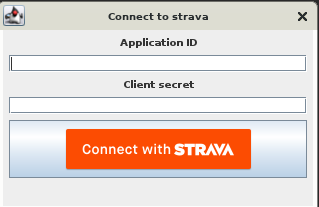

This software needs configuring your Strava account. 
You need to setup your own API application (https://www.strava.com/settings/api) and use your application client secret and id in the initial application setup dialog.

IMPORTANT!
=
This application runs best with Java 11. 
If you run in java version bigger than 11 -> then the runtime does not start, because of changes in built-in JAXB, it's no longer in the jvm itself.  
You need to add jars to the classpath, or add glassfish implementations to pom.xml. None of these solutions is recommended. Just run it from Java 11.
However, there's a workaround planned so that it works out of the box anytime with any java >=11. Stay tuned, but until then - use Java 11.

BINARY RELEASES
=
Binary releases are planned, so you'll just need to download the executable/runnable artifact. No building, no tuning. Download and run.
